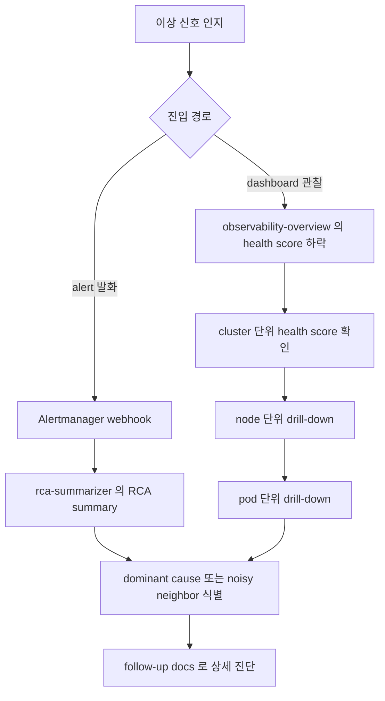

# 운영자 통합 진입점 가이드

본 문서는 eBPF 기반 GPU 통합 observability 시스템의 신규 운영자를 위한 단일 진입점이다. 시스템 컴포넌트의 책임 분리와 alert 발화에서 root cause 도달까지의 전체 워크플로와 주요 운영 시나리오 3종의 단계별 가이드와 영역별 docs 색인을 한 곳에서 제공한다. 개별 기능의 상세는 영역별 docs로 위임하고 본 문서는 흐름의 길잡이 역할만 한다.

## 시스템 개요

본 시스템은 5 컴포넌트로 구성되며 각 컴포넌트는 책임 영역이 분리되어 있다.

| 컴포넌트 | 배포 형태 | 포트 | 책임 |
|---|---|---|---|
| `netobs-agent` | DaemonSet | `:9810` | eBPF kprobe 기반 TCP 송신과 수신 stage latency와 drop reason과 retransmission 측정. Pod 간 flow의 5-tuple RX/TX 추적 |
| `gpuobs-agent` | DaemonSet | `:9820` | NVML 기반 GPU 디바이스 상태와 메모리 점유 측정. CUDA uprobe 기반 kernel launch와 memcpy와 stream sync latency 측정 |
| `correlation-exporter` | Deployment | `:9830` | `netobs_*`와 `gpuobs_*` 시계열을 주기적으로 fetch해 Pearson 상관계수 산출 후 Top-N noisy neighbor를 emit. cross-node interference 분석 |
| `rca-summarizer` | Deployment | `:9850` | Alertmanager webhook 수신 후 alert별 RCA 매핑과 multi-source cross-reference 기반 confidence score 산출 |
| `workload-injector-controller` | Deployment | `:9840` | dev cluster 한정 합성 부하 (cpu와 memory와 network와 gpu) 자동 주입으로 correlation 분석 layer 검증 |

두 agent (`netobs-agent`와 `gpuobs-agent`) 는 관측 대상 노드에 DaemonSet으로 배포되고 `correlation-exporter`와 `rca-summarizer`는 cluster 단위 singleton Deployment다. 모든 컴포넌트는 Prometheus가 scrape하는 `/metrics` endpoint를 노출하며 recording rule과 alert rule은 `deploy/*/base/prometheus-rule.yaml`에 정의되어 있다.

## 전체 워크플로 다이어그램

운영자가 이상 신호를 인지하는 시점부터 root cause 도달까지의 흐름은 다음과 같다.

alert 발화 경로는 `rca-summarizer`가 webhook을 받아 RCA summary를 산출하는 빠른 진단을 제공하고 dashboard 관찰 경로는 운영자가 `observability-overview` 대시보드에서 cluster에서 node 거쳐 pod로 좁혀가는 drill-down 흐름을 제공한다. 두 경로 모두 dominant cause 또는 noisy neighbor 식별로 수렴하며 최종 단계에서 영역별 follow-up docs로 상세 진단한다.

## 다음 단계

- 구체적 운영 흐름은 아래 [주요 운영 시나리오](#주요-운영-시나리오) 3종의 단계별 가이드를 따른다
- 영역별 상세 docs는 [기존 docs 영역별 색인](#기존-docs-영역별-색인)에서 찾는다
- dashboard drill-down의 4 단계 워크플로는 [dashboard-workflow.md](observability/dashboard-workflow.md)를 참조한다
