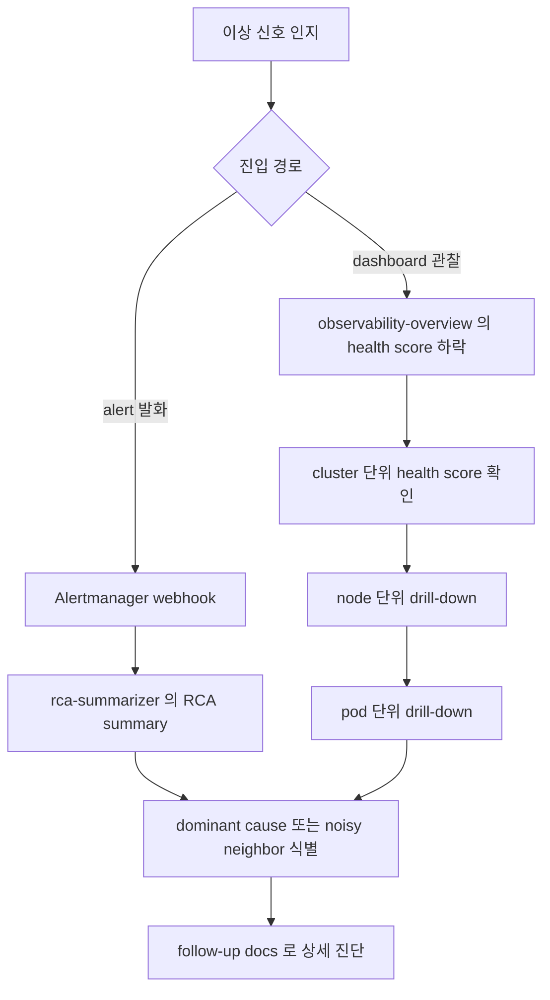

# 운영자 통합 진입점 가이드

본 문서는 eBPF 기반 GPU 통합 observability 시스템의 신규 운영자를 위한 단일 진입점이다. 시스템 컴포넌트의 책임 분리와 alert 발화에서 root cause 도달까지의 전체 워크플로와 주요 운영 시나리오 3종의 단계별 가이드와 영역별 docs 색인을 한 곳에서 제공한다. 개별 기능의 상세는 영역별 docs로 위임하고 본 문서는 흐름의 길잡이 역할만 한다.

## 시스템 개요

본 시스템은 5 컴포넌트로 구성되며 각 컴포넌트는 책임 영역이 분리되어 있다.

| 컴포넌트 | 배포 형태 | 포트 | 책임 |
|---|---|---|---|
| `netobs-agent` | DaemonSet | `:9810` | eBPF kprobe 기반 TCP 송신과 수신 stage latency와 drop reason과 retransmission 측정. Pod 간 flow의 5-tuple RX/TX 추적 |
| `gpuobs-agent` | DaemonSet | `:9820` | NVML 기반 GPU 디바이스 상태와 메모리 점유 측정. CUDA uprobe 기반 kernel launch와 memcpy와 stream sync latency 측정 |
| `correlation-exporter` | Deployment | `:9830` | `netobs_*`와 `gpuobs_*` 시계열을 주기적으로 fetch해 Pearson 상관계수 산출 후 Top-N noisy neighbor를 emit. cross-node interference 분석 |
| `rca-summarizer` | Deployment | `:9850` | Alertmanager webhook 수신 후 alert별 RCA 매핑과 multi-source cross-reference 기반 confidence score 산출 |
| `workload-injector-controller` | Deployment | `:9840` | dev cluster 한정 합성 부하 (cpu와 memory와 network와 gpu) 자동 주입으로 correlation 분석 layer 검증 |

두 agent (`netobs-agent`와 `gpuobs-agent`) 는 관측 대상 노드에 DaemonSet으로 배포되고 `correlation-exporter`와 `rca-summarizer`와 `workload-injector-controller`는 cluster 단위 singleton Deployment다. 단 `workload-injector-controller`는 합성 부하 자동 주입의 prod 오발 방지를 위해 dev cluster 한정으로만 배포된다. 모든 컴포넌트는 Prometheus가 scrape하는 `/metrics` endpoint를 노출하며 recording rule과 alert rule은 `deploy/*/base/prometheus-rule.yaml`에 정의되어 있다.

## 전체 워크플로 다이어그램

운영자가 이상 신호를 인지하는 시점부터 root cause 도달까지의 흐름은 다음과 같다.

alert 발화 경로는 `rca-summarizer`가 webhook을 받아 RCA summary를 산출하는 빠른 진단을 제공하고 dashboard 관찰 경로는 운영자가 `observability-overview` 대시보드에서 cluster에서 node 거쳐 pod로 좁혀가는 drill-down 흐름을 제공한다. 두 경로 모두 dominant cause 또는 noisy neighbor 식별로 수렴하며 최종 단계에서 영역별 follow-up docs로 상세 진단한다.

## 다음 단계

- 구체적 운영 흐름은 아래 [주요 운영 시나리오](#주요-운영-시나리오) 3종의 단계별 가이드를 따른다
- 영역별 상세 docs는 [기존 docs 영역별 색인](#기존-docs-영역별-색인)에서 찾는다
- dashboard drill-down의 4 단계 워크플로는 [dashboard-workflow.md](observability/dashboard-workflow.md)를 참조한다

## 주요 운영 시나리오

각 시나리오는 진입점 식별과 dashboard drill-down과 cross-reference와 follow-up docs 진입의 4 단계로 구성된다. 모든 시나리오의 dashboard 진입점은 uid `observability-overview`의 통합 대시보드다.

### 시나리오 1. GPU 유휴 원인 진단

GPU가 유휴 상태인데 그 원인이 PCIe 점유인지 network pressure인지 cpu throttle인지 식별하는 흐름이다.

| 단계 | action |
|---|---|
| 1. 진입점 식별 | `GPUIdleWithPCIeSaturation`이나 `GPUIdleWithNetworkPressure`나 `GPUIdleWithCPUThrottle`이나 `GPUIdleWithMemoryPressure`나 `GPUIdleWithHostComputeStall` alert 발화. 또는 dashboard의 `GPU health` single-stat 하락과 `GPU idle dominant cause` indicator 변동 |
| 2. dashboard drill-down | `observability-overview`의 `GPU idle dominant cause` stat에서 dominant cause 1종 확인. alert label의 `node`와 `src_pod`로 `$node`와 `$src_pod` variable 선택 후 Pod drill-down row 이동 |
| 3. cross-reference | Pod drill-down의 `Noisy neighbor Top-N (victim=$src_pod)` 표에서 dominant cause의 dimension과 일치하는 suspect 확인. `Pod 별 RX/TX 대역폭` panel로 network 신호 cross-check |
| 4. follow-up docs | [diagnosis-gpu-idle.md](correlation/diagnosis-gpu-idle.md)의 score 조합 패턴별 해석 표와 [gpu-idle-dominant-cause.md](observability/gpu-idle-dominant-cause.md)의 cause 라벨 enum과 victim 단위 워크플로 참조 |

### 시나리오 2. Drop spike 추적

네트워크 패킷 drop이 급증한 시점과 지점 (node와 pod) 과 원인 (drop reason) 을 특정하는 흐름이다.

| 단계 | action |
|---|---|
| 1. 진입점 식별 | `NetObsDropBurst` alert 발화. 또는 dashboard의 `Network health` single-stat 하락과 `Resource anomaly spike` row의 network drop rate z-score 임계 초과 |
| 2. dashboard drill-down | alert label의 `node`로 `$node` variable 선택 후 Node drill-down row의 `Node drop / retrans rate (drop_category 별)` panel에서 drop_category 분포 확인 |
| 3. cross-reference | Pod drill-down의 `Pod 별 RX/TX 대역폭` panel로 대역폭 burst와 drop spike의 동시 발생 여부 확인. burst 동반 시 NIC saturation 의심 |
| 4. follow-up docs | [drop-reason.md](netobs/drop-reason.md)의 reason 매핑 표와 [drop-flow-analysis.md](netobs/drop-flow-analysis.md)의 5-tuple flow 분석과 [drop-stack-capture.md](netobs/drop-stack-capture.md)의 kernel stack trace 참조 |

### 시나리오 3. Capacity 계획

자원 사용 추이의 시간대별 패턴을 파악하고 baseline 대비 이상 징후를 선행 감지하는 흐름이다.

| 단계 | action |
|---|---|
| 1. 진입점 식별 | dashboard의 `Capacity trends` row의 4 도메인 (GPU utilization과 network throughput과 CPU throttle과 memory pressure) heatmap에서 요일과 시간대 패턴 관찰 |
| 2. dashboard drill-down | 각 도메인의 4주 시간대 trend overlay와 30일 baseline 대비 z-score panel에서 추세 이탈 시점 확인 |
| 3. cross-reference | `Resource anomaly spike` row의 5분 z-score (7일 baseline 대비) 와 비교해 단기 spike와 장기 추세를 구분 |
| 4. follow-up docs | [capacity-trends.md](observability/capacity-trends.md)의 z-score 임계의 운영적 의미와 알림 4종 발화 조건과 [resource-anomaly-spike.md](observability/resource-anomaly-spike.md)의 단기 spike 해석 참조 |

## 기존 docs 영역별 색인

29종 영역별 docs를 9 영역으로 분류한 단일 색인이다. 신규 운영자가 시스템 학습 시 영역별 상세 문서를 본 색인에서 찾는다.

### netobs (eBPF 네트워크 관측)

- [drop-reason.md](netobs/drop-reason.md): netobs drop reason 매핑
- [drop-flow-analysis.md](netobs/drop-flow-analysis.md): drop flow 5-tuple 분석 가이드
- [drop-stack-capture.md](netobs/drop-stack-capture.md): drop event kernel stack trace capture
- [flow-tracking.md](netobs/flow-tracking.md): Pod 간 정상 flow의 5-tuple RX/TX 실시간 추적
- [send-path-stage-latency.md](netobs/send-path-stage-latency.md): send path stage latency 분해
- [rcv-path-tcp-state.md](netobs/rcv-path-tcp-state.md): receive path latency와 TCP 상태 운영 가이드
- [protocol-coverage.md](netobs/protocol-coverage.md): netobs IPv6와 UDP 트래픽 추적 운영 가이드
- [bpf-self-health.md](netobs/bpf-self-health.md): BPF program attach self-health 운영 가이드
- [bpf-map-safety.md](netobs/bpf-map-safety.md): BPF map race safety audit 결과

### gpuobs (GPU 자원 관측)

- [pod-level-gpu.md](gpuobs/pod-level-gpu.md): Pod-level GPU utilization 운영 가이드
- [cuda-sync-latency.md](gpuobs/cuda-sync-latency.md): CUDA stream과 event 동기화 latency 운영 가이드
- [rtx-thermal-correlation.md](gpuobs/rtx-thermal-correlation.md): RTX consumer GPU의 thermal과 power와 clock 상관 분석 운영 가이드
- [dcgm-nccl-integration.md](gpuobs/dcgm-nccl-integration.md): NVIDIA DCGM과 NCCL profiling 인터페이스 통합

### correlation (간섭 상관 분석)

- [diagnosis-gpu-idle.md](correlation/diagnosis-gpu-idle.md): GPU 유휴 원인 진단 가이드
- [cross-node-interference.md](correlation/cross-node-interference.md): cross-node interference layer
- [granger-causality.md](correlation/granger-causality.md): Granger causality와 dominant dimension 운영 가이드

### observability (대시보드와 알림)

- [dashboard-workflow.md](observability/dashboard-workflow.md): observability overview 운영 가이드
- [drill-down-navigation.md](observability/drill-down-navigation.md): cluster-node-pod drill-down navigation
- [gpu-idle-dominant-cause.md](observability/gpu-idle-dominant-cause.md): GPU 유휴 dominant cause 가중치 ranking 운영 가이드
- [gpu-network-correlation.md](observability/gpu-network-correlation.md): GPU와 network cross-correlation 통합 패널
- [capacity-trends.md](observability/capacity-trends.md): capacity-trends 운영자 가이드
- [resource-anomaly-spike.md](observability/resource-anomaly-spike.md): resource-anomaly-spike 운영자 가이드
- [alert-annotation.md](observability/alert-annotation.md): alert annotation 운영자 가이드
- [alert-routing.md](observability/alert-routing.md): Alert routing skeleton 운영 가이드

### rca (root cause analysis)

- [multi-source-mapping.md](rca/multi-source-mapping.md): RCA 매핑 multi-source cross-reference

### injector (합성 부하 자동화)

- [auto-scenarios.md](injector/auto-scenarios.md): LoadScenario 자동 부하 시나리오 운영 가이드

### api (REST API)

- [rest-api.md](api/rest-api.md): REST API layer 운영자 가이드

### monitoring (인프라 모니터링)

- [retention-disk.md](monitoring/retention-disk.md): Prometheus retention 디스크 용량 자동 모니터링

### perf (성능 측정)

- [cuda-uprobe-overhead.md](perf/cuda-uprobe-overhead.md): cuda uprobe dispatch hot path overhead 측정
